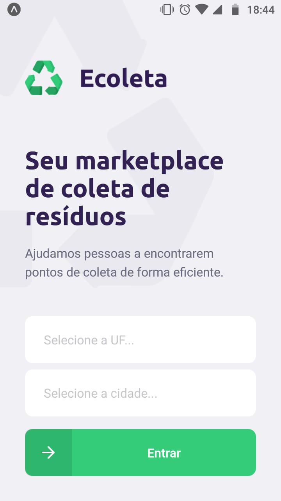

  

## Curso online criado pela Rocketseat.
### O curso foi ministrado por Diego Fernandes CTO na Rocketseat, e durante a semana foram usadas as seguintes tecnologias:

| Backend                                           |           Frontend                               |              Mobile  |
| -------------------                               | -------------------                              |  ------------------- |
|  - [Node.js](https://nodejs.org/en/)              |  - [React.js](https://reactjs.org)                  | - [React Native](https://facebook.github.io/react-native/) |
|  - [TypeScript](https://www.typescriptlang.org/)  |  - [TypeScript](https://www.typescriptlang.org/) |  - [TypeScript](https://www.typescriptlang.org/) |
|  - [Knex](http://knexjs.org/)                     | - [Leaflet](https://leafletjs.com/)              | - [Expo](https://expo.io/) |
|  - [SQLite](https://www.sqlite.org/index.html)    |   

Além do banco de dados utilizado durante a semana, fiz integração com o banco de dados - [MySQL](https://www.mysql.com/) 

## O Projeto ♻️ Ecoleta

* O Ecoleta é um projeto criado para ajudar as pessoas a encontrarem os pontos de coleta de lixo com mais eficiência.

## Clique para ver o video no YouTube

